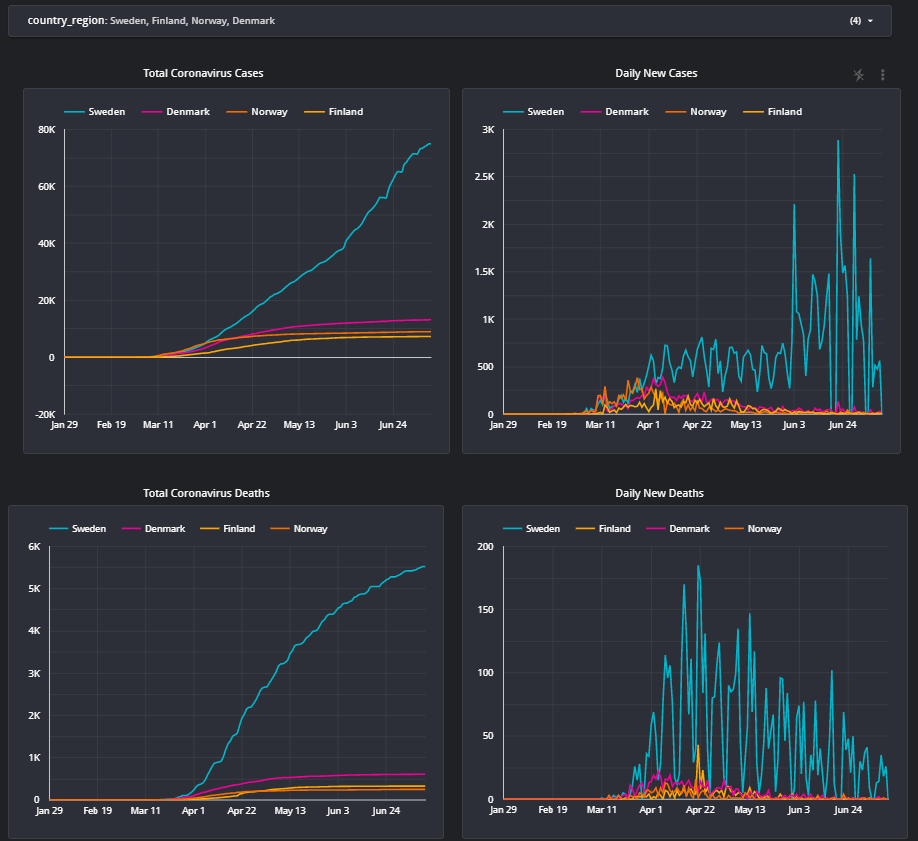
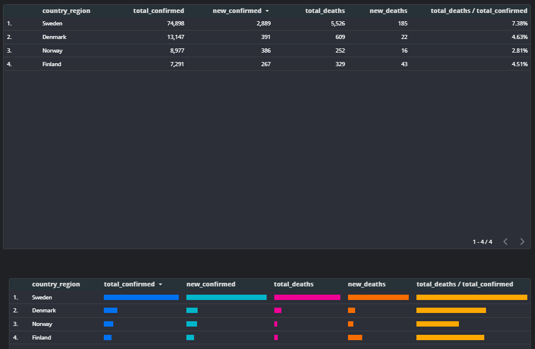

# Google-Cloud-Platform

## 1. covid19_summary.sql

BigQuery + Data Studio

Today I tried to use GCP BigQuery + Data Studio generating COVID-19 summary report. It's so powerful and easy-to-use tool. Especially following two powerful functions surprised me.

>Query: LAG() OVER Window PARTITION function 
>Data Studio: Filter

## https://datastudio.google.com/s/saw_0IVG0fk

## 2. degcp_running_spark_jobs_locally.ipynb
### Project: Running Apache Spark jobs locally
